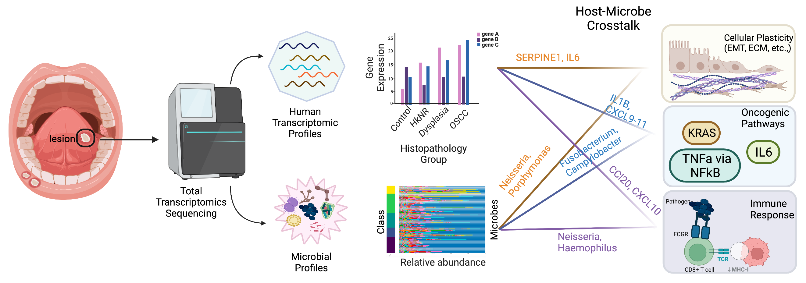

<h1> Title: Total RNA sequencing reveals gene expression and microbial alterations shared by oral pre-malignant lesions and cancer. </h1>

This code repo contains relevant data, scripts and results for the PML project.

<u>**Analysis overview:**</u>
A cohort of 66 patients' oral tissue were sequenced to obtain gene expression and microbial abundance profiles to study their transcriptome. The cohort were divided into five histopathological groups - control (normal mucosa), HkNR (hyperkeratosis; not reactive), dysplasia, and OSCC (oral squamous cell carcinoma). The key findings from this analysis is represented through this graphical abstract shown below:

**Directory structure:**  
`/scripts` - all the relevant scripts and compiled (.html) files for the analysis.  
`/data` - input data (expression data of host and microbes, annotation data, etc.,)  
`/results` - all results from various methods.  

<u>A short description of analysis scripts: </u>  
`00_summ_stats.{Rmd, html}` -  
`01_imp_summary.{Rmd, html}` - imputation to obtain smoking status for missing patients (n=11)  
`02_dimred_hvg.{Rmd, html}` - Dimensionality reduction on gene expression data, clustering analysis, finding highly variable genes.  
`03_diffanalysis.{Rmd, html}` - pairwise differential expression analysis using DESeq2 between histopathological groups.  
`04_hyper_gsva_sigs.{Rmd, html}` - overrepresentation analysis using hypeR from the differentially expressed genes and GSVA enrichment analysis on relevant signatures.  
`05_immune_deconv.{Rmd, html}` - Immune cell-type deconvolution analysis using CIBERSORT scores.  
`06_micro_analysis_msea.{Rmd, html}` - Microbial abundance analysis and MSEA enrichment analysis.  
`07_microbiome_msea.{ipynb, html}` - MSEA analysis using msets derived from published microbe-host genes compendium.  
